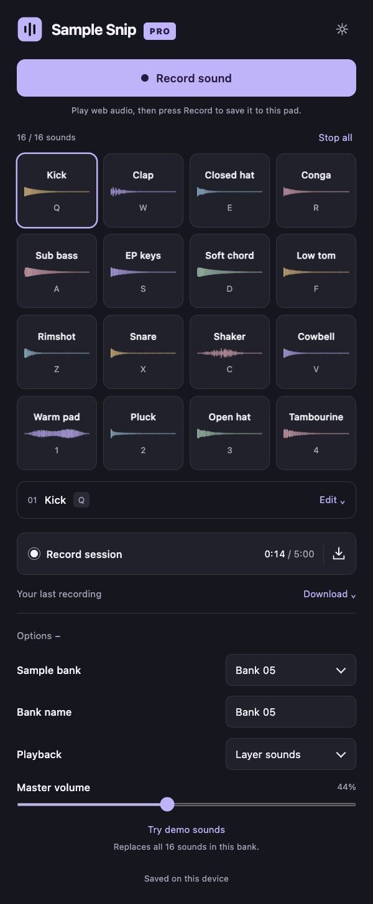
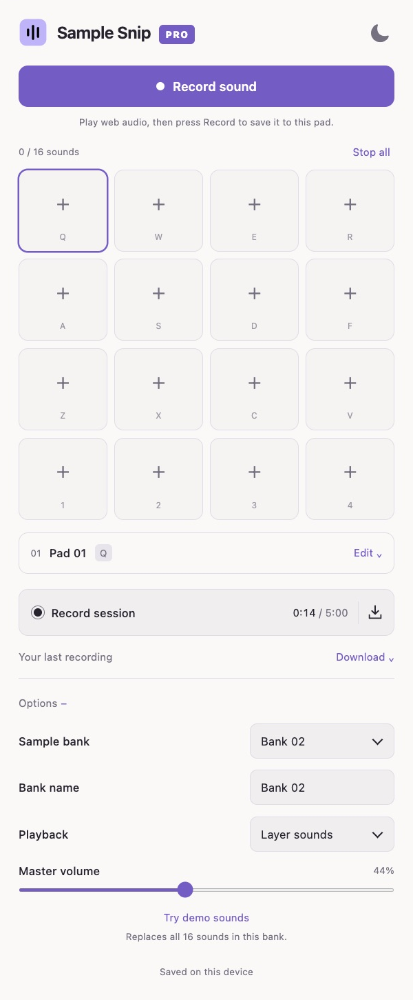

# Sample Snip Pro

A browser extension for capturing web audio and playing it on a 16-pad sampler. Save sounds across five banks, play them with your mouse or keyboard, and download a recording of your performance.

<table>
  <tr>
    <th>Dark theme · demo samples</th>
    <th>Light theme · empty pads</th>
  </tr>
  <tr>
    <td></td>
    <td></td>
  </tr>
</table>

Both screenshots show only the installed plugin interface.

## Install

Requires Chrome 116+ or Chromium-based Edge with side-panel and tab-capture support.

1. Download this repository using **Code → Download ZIP**, then extract it.
2. Open `chrome://extensions` or `edge://extensions` and enable **Developer mode**.
3. Choose **Load unpacked** and select the folder containing `manifest.json`.
4. Pin **Sample Snip Pro** in the toolbar. Click its icon, then **Open pads**.

Pro has its own saved library and can be installed alongside Simple Snip. It has not been published to extension stores.

## Capture and play

Play audio in a webpage, select a pad, and press **Record sound**. Press **Stop recording** to save it; capture stops automatically at 60 seconds. A successful recording replaces the selected pad's sound and resets its trim while keeping its name, key, color, volume, and loop setting. Failed captures keep the previous sound.

Tap a loaded pad or press its displayed key while the sampler has focus. Defaults are **Q W E R / A S D F / Z X C V / 1 2 3 4**. **Stop all** or **Escape** stops playback. **Layer sounds** mixes pads; **Cut previous** stops other pads when a new sound starts.

Use a pad's **⋯** button to select it without playing. Open **Edit** to rename it, assign a letter or number, loop it, import audio, or save its trimmed sound as WAV. Assigning an occupied key swaps the two bindings. Drag the waveform handles to trim, or drag the selection to move it. The time fields remain available for precise edits.

**Options** opens by default. Choose one of five banks, edit its name, and adjust playback or master volume. **Try demo sounds** replaces all sixteen sounds in the current bank with the synthesized kit, including recorded sounds; other banks stay untouched. The kit includes distinct drums, percussion, bass, keys, chords, a pad, and a pluck.

## Record a performance

Press **Record session**, play your pads, then **Stop session**. Sessions stop automatically at five minutes. Preview and rename the completed take, then download its stereo 16-bit WAV. The download icon saves the latest completed take directly.

Session recordings contain the pad mix, including trims, layers, loops, and silence. Keep the sampler open during a performance. Download takes you want to keep: only the latest completed session is retained locally.

## Local storage and capture

Sounds and the latest session stay in this browser profile. Bank names and interface preferences are also saved locally. There are no uploads, accounts, microphone capture, or third-party runtime dependencies. Clearing extension data or removing the extension can erase this library.

Browser-internal pages and some protected media cannot be captured. Browser audio capture requires the installed extension; the development preview supports demo sounds and imports. Audio-device latency varies, especially with Bluetooth.

## Development

Use Node.js 22.15+ or 24 and Python 3. The extension runs directly from source without a build step.

```sh
npm ci
npm test
npm run format:check
npm run preview
```

Open `http://127.0.0.1:4174/studio.html` for the interface preview. Use `npm run format` to format source, `npm run icons` to regenerate PNG icons from `icons/logo.svg`, and `node scripts/render-demo.mjs` to export demo WAVs into the ignored `design/audio/` directory.

```sh
npm run package
```

Packaging writes a versioned ZIP and `release/sample-snip-pro-chrome/`, containing the extension runtime, this README, and its screenshots. Reload the extension on its extensions page after source changes.

| Files                                                         | Responsibility                                         |
| ------------------------------------------------------------- | ------------------------------------------------------ |
| `popup.*`, `background.js`                                    | Toolbar entry, panel opening, and capture coordination |
| `capture.js`, `offscreen.html`                                | Browser audio capture and replacement storage          |
| `studio.*`                                                    | Sampler interface and user actions                     |
| `engine.js`                                                   | Cached audio playback, mixing, and session recording   |
| `trim-editor.js`, `waveform.js`                               | Drag trimming and waveform rendering                   |
| `pcm-worklet.js`, `encoding.js`, `encode-worker.js`, `wav.js` | Frame-limited PCM recording and WAV encoding           |
| `model.js`, `banks.js`, `storage.js`                          | Pad rules, bank names, and local persistence           |
| `demo.js`                                                     | Original procedural instrument sounds                  |

Pad hits schedule from decoded buffers on one interactive audio context. WAV encoding runs in a worker, and recording limits are enforced on the audio thread. The test suite covers recording limits, audio routing, replacement recovery, pad controls, trimming, bank persistence, browser gestures, and demo sound characteristics.
